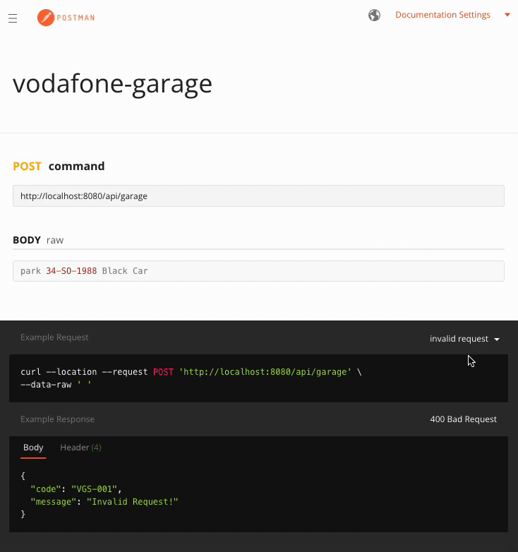

## :taxi: :minibus:  vodafone-garage :tractor: :bus:

> You have a garage that can be parked up to 10 slots (you can consider each slot is 1 unit range) at any
> given point in time. You should create an automated ticketing system that allows your customers to use your garage
> without human intervention. When a car enters your garage, you give a unique ticket issued to the driver. The ticket
> issuing process includes us documenting the plate and the colour of the car and allocating an available slots to the car
> before actually handing over a ticket to the driver. When a vehicle holds number of slots with its own width, you have to
> leave 1 unit slot to next one. The customer should be allocated slot(s) which is nearest to the entry. At the exit the
> customer returns the ticket which then marks slot(s) they were using as being available.


##### Sample Input
``` 
park 34-SO-1988 Black Car
park 34-BO-1987 Red Truck
park 34-VO-2018 Blue Jeep
park 34-HBO-2020 Black Truck
leave 3
park 34-LO-2000 White Car
status
```

##### Sample Output
``` 
Allocated 1 slot.
Allocated 4 slots.
Allocated 2 slots.
Garage is full.
Allocated 1 slot.
Status:
34-SO-1998 Black [1]
34-BO-1987 Red [3,4,5,6]
34-LO-2000 Black [8]
```


##### Tech Stack & Patterns :dart:
* Java 17
* Spring Boot
* Maven
* Junit (Test Coverage 72%)
* Swagger
* Factory Pattern


##### Postman API (please visit) :policeman:
https://documenter.getpostman.com/view/2522238/UVsJvRto



##### Swagger UI :gift:
http://localhost:8080/swagger-ui/index.html

##### License :key:
Distributed under the MIT License. See [LICENSE](LICENSE) for more information.
